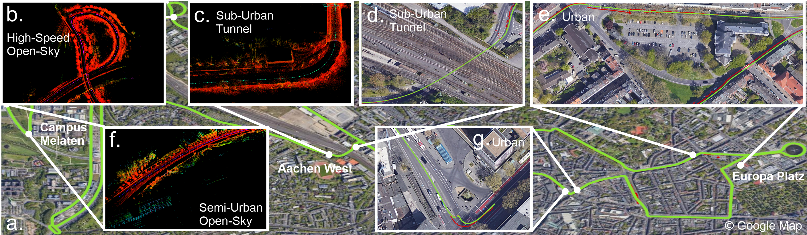
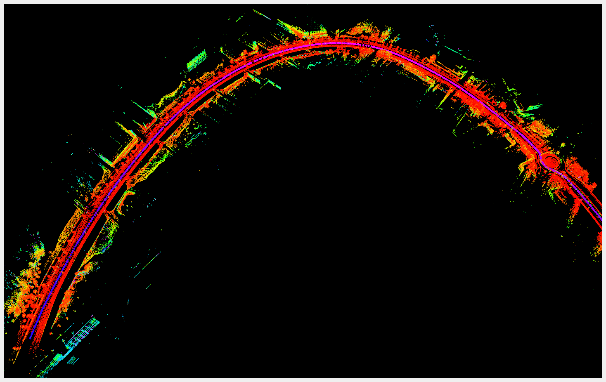
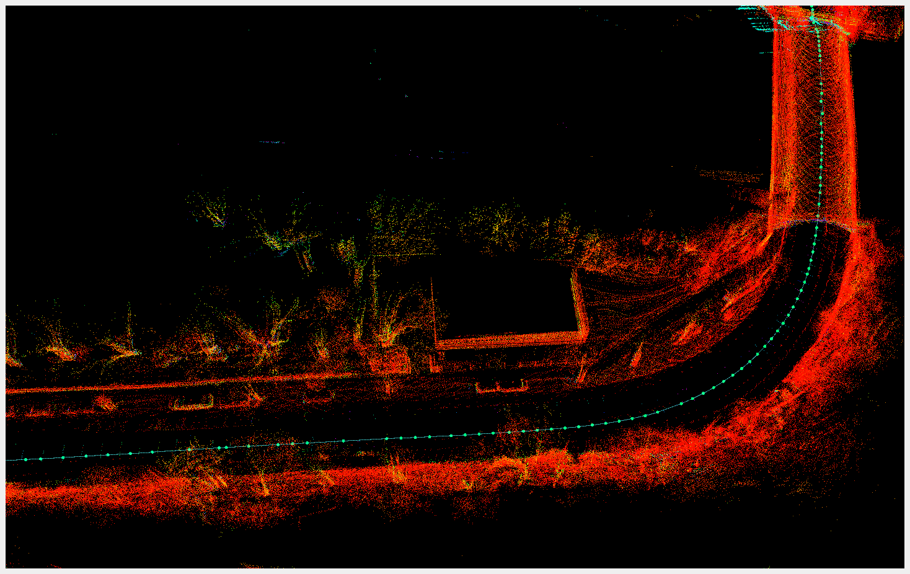
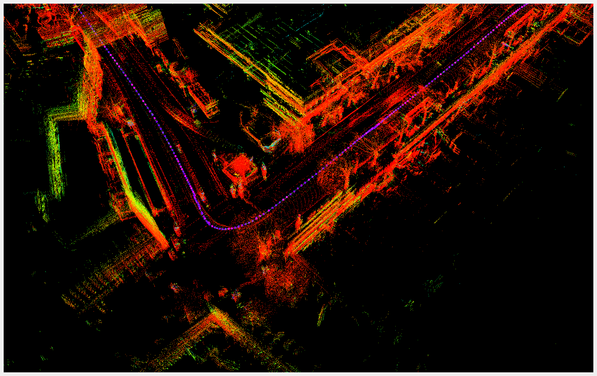
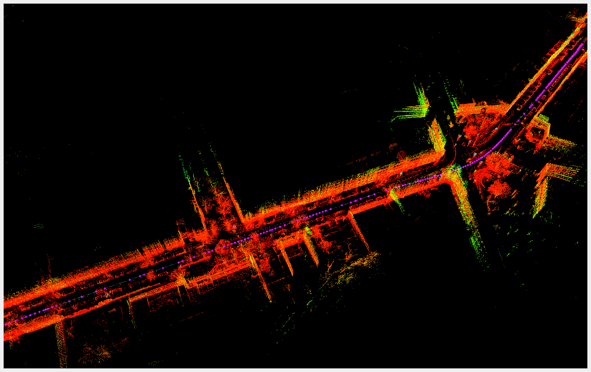

# onlineFGO: Online Continuous-Time Factor Graph Optmization with Time-Centric Multi-Sensor Fusion for Robust Localization in Large-Scale Environments
This is the official repo of the project onlineFGO.

Code will be published in Mai based on the publication schedule. 

For more information and sample request, please contact h.zhang@irt.rwth-aaachen.de

## First Results

  
   

  
  

**Current Pre-Print:** 
  - H. Zhang, F. Widmayer, L. Lünnemann, D. Abel, **onlineFGO: Online Continuous-Time Factor Graph Optimization with Time-Centric Multi-Sensor Fusion for Robust Localization in Large-Scale Environments**, arXiv:2211.05400 (2022).[paper](https://arxiv.org/abs/2211.05400)